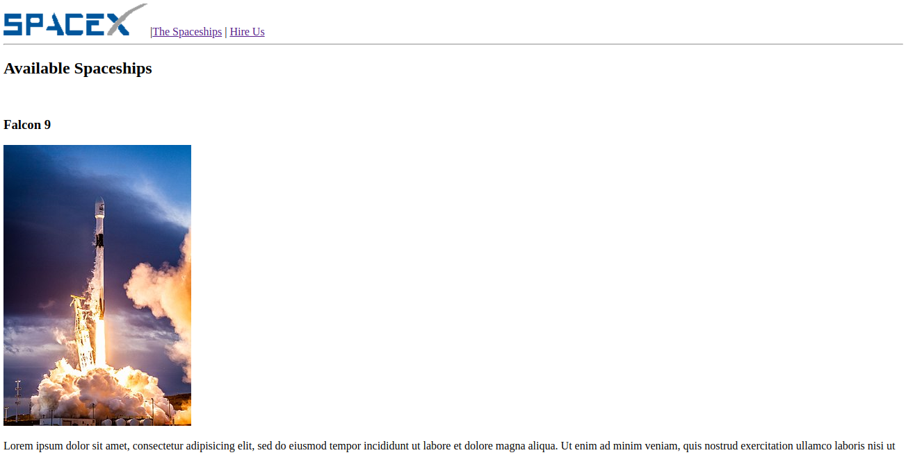
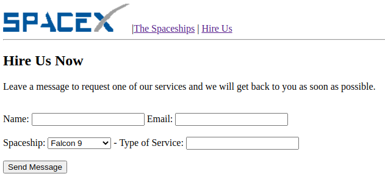

# SpaceX - Site fictício

O site fui criado durante o curso "Programador Full Stack Javascript" da onebitcode.

## O qué e o projeto
Um site fictício da SpaceX, criado para fins de estudo das tecnologias HTML, e CSS, objetivo do site e apresentar a empresa e seus serviços, além de contar com uma área para que o usuário possa contratar os serviços da SpaceX.

## Principais funcionalidades

### Apresentar a empresa e seus serviços
Se trata da tela principal do site, onde são apresentados os serviços da empresa, além de falar um pouco da empresa.

### Apresentação das spaceships da empresa
Nesta tela sera listada todas as spaceships da empresa, com uma descrição detalhada sobre cada uma delas.

### Formulário para contratação dos serviços da empresa
Através deste formulário você pode entrar em contato com a empresa e contratar os seus serviços.

## Como Executa-lo

Basta clonar o projeto, ou baixar e abrir o arquivo index.html, eu seu navegador.

## Diário de bordo

**Dia 1 - 04/07/2021**

A primeira funcionalidade foi construída, no caso a pagina principal, onde existe uma apresentação da empresa e seus serviços.

Para o cabeçalho da página usamos as tags `<header>` e `<nav>`.

A tag `<nav>` foi ultilizada pois nas próximas atualizações o menu principal deve ficar no cabeçalho com a logomarca.

Em seguida foram criadas três seções, usando a tag `<section>`

Sendo que a primeira seção abrange os três primeiros parágrafos do site, a segunda contem uma lista com outros serviços da empresa, e a terceira seção envolve uma tabela de preços.

Para criar a lista usamos a tag `<ul></ul>` criando assim uma lista não ordenada.

E para a tabela usamos a tag `<table>`

**Dia 2 - 14/07/2021**

A pagina spaceship foi criada, ela lista algumas espaçonaves, com imagens e descrição de cada espaçonave

**Dia 3 - 15/07/2021**

A pagina **Hire Us** foi adicionada, ela possui um formulário para que o usuário possa entrar em contato com a empresa.

O formulário foi criado com inputs do tipo text, search, e o submit, foi durante o desenvolvimento deste formulário que eu usei pela primeira vez a tag datalist, ainda estou estudando essa tag, mas acredito que já entendi seu funcionamento.

A tag datalist tras uma lista de opções possíveis para os valores de outros controles (inputs)
