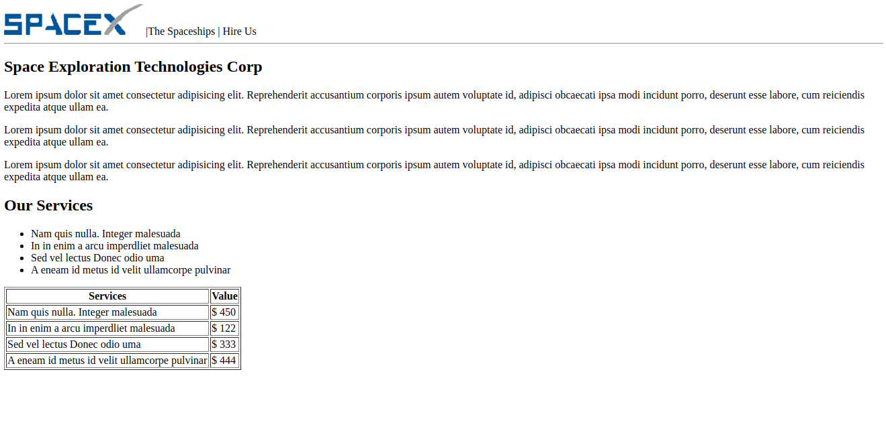

# SpaceX - Site fictício

Um site fictício da SpaceX, criado para fins de estudo
das tecnologias HTML, e CSS

## O qué e o projeto

O site fui criado durante o curso "Programador Full Stack Javascript" da onebitcode.

## Principais funcionalidades

### Apresentar a empresa e seus serviços
Se trata da tela principal do site, onde são apresentados os serviços da empresa, além de falar um pouco da empresa.

## Como Executa-lo

Basta clonar o projeto, ou baixar e abrir o arquivo index.html, eu seu navegador.

## Diário de bordo

**Dia 1 - 04/07/2021**

A primeira funcionalidade foi construída, no caso a pagina principal, onde existe uma apresentação da empresa e seus serviços.

Para o cabeçalho da página usamos as tags `<header>` e `<nav>`.

A tag `<nav>` foi ultilizada pois nas próximas atualizações o menu principal deve ficar no cabeçalho com a logomarca.

Em seguida foram criadas três seções, usando a tag `<section>` 

Sendo que a primeira seção abrange os três primeiros parágrafos do site, a segunda contem uma lista com outros serviços da empresa, e a terceira seção envolve uma tabela de preços.

Para criar a lista usamos a tag `<ul></ul>` criando assim uma lista não ordenada.

E para a tabela usamos a tag `<table>`